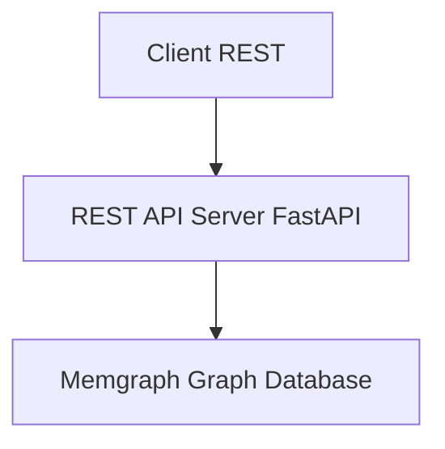

# REST to Memgraph Adapter - System Design (Python/FastAPI)

## Goal

Expose a RESTful API that directly queries a Memgraph graph database, so clients can access data using traditional REST endpoints.

---

## High-Level Architecture



---

##  Components
The system is decomposed into focused layers so query logic, transport, and infrastructure concerns remain isolated and testable.

### REST API Layer (FastAPI)
- Defines and documents REST endpoints (e.g. `/sample/by/{field}/count`) with automatic OpenAPI schema.
- Handles HTTP concerns: routing, parsing, status codes, paging, filtering.
- Uses Pydantic models for request/response validation and serialization.
- Dependency Injection for shared concerns (db sessions, config, cache).
- Delegates all data fetching to the Service layer (no raw Cypher here).

### Service Layer
- Orchestrates one or more repository (data access) calls
- Implements domain logic / aggregations / post-processing
- Converts lower‑level data structures into response DTOs

### Data Access Layer (Memgraph Repository)
- Encapsulates Cypher queries & parameter binding via the Neo4j Python driver (Memgraph-compatible).
- Provides reusable functions: `get_sample_counts_by(field)`, etc.
- Central place to optimize queries / add caching hints.

### Memgraph Graph Database
- Stores domain entities as nodes & relationships (e.g. `(:Sample)`)
- Queried via Cypher over Bolt protocol

### Caching Layer (Optional)
- Redis (or in‑memory) for hot/read‑heavy aggregation endpoints.
- Key strategy: namespaced keys `sample:count:<field>` with TTL.

### Validation & Security
- Input validation with Pydantic schemas (FastAPI request models) and custom validators.
- Rate limiting via `slowapi` (Starlette middleware), CORS via `CORSMiddleware`, security headers via `secure` or custom middleware, auth (future JWT / API key) via FastAPI dependencies.

### Observability
- Structured logging (`structlog` or standard `logging`) with request correlation IDs.
- Metrics via `prometheus_client` and optional `starlette_exporter`; health/readiness probes.

### Configuration & Secrets
- Centralized config using `pydantic-settings` (or environment variables with `python-dotenv`).
- Supports environment overlays (dev, test, prod).

### Error Handling
- Normalizes errors to a consistent JSON envelope.
- FastAPI exception handlers map domain exceptions (validation, unsupported field, Cypher failure) to proper HTTP codes.

---

## Tech Stack

| Layer | Technology | Purpose |
|-------|------------|---------|
| Runtime | Python 3.10+ | Server-side logic |
| Web Framework | FastAPI + Uvicorn | RESTful routing, async I/O, auto OpenAPI |
| Graph Database Client | `neo4j` Python driver (Memgraph-compatible) | Bolt connectivity & Cypher execution |
| Env Config | `pydantic-settings` + `python-dotenv` | Manage configuration and secrets |
| Input Validation | Pydantic (FastAPI models) | Validate and serialize requests/responses |
| Caching (optional) | `redis` (redis-py) or `redis.asyncio` | Cache Cypher query results |
| Logging | `structlog` or `logging` + Uvicorn access logs | Structured app and HTTP logs |
| Metrics (optional) | `prometheus_client` + `starlette_exporter` | Export Prometheus metrics |
| Documentation | FastAPI auto docs (Swagger UI/Redoc) | REST endpoint docs (OpenAPI) |
| Security | Starlette middlewares (CORS, GZip, TrustedHost), `slowapi` | Headers, CORS & abuse protection |
| Testing | pytest + httpx (+ pytest-asyncio) | Unit & integration tests |
| Containerization | Docker | Deployment packaging |
| Linting / Style | ruff, black, isort, mypy | Code quality & consistency |

---

## API Surface (Derived from `swagger.yml`)

The OpenAPI spec (`swagger.yml`) defines the contract. Core resource groups:

| Group | Endpoints (GET) | Purpose |
|-------|------------------|---------|
| Subject | `/subject`, `/subject/{organization}/{namespace}/{name}`, `/subject/by/{field}/count`, `/subject/summary` | Line-level subject data, retrieval by ID, grouped counts & summary |
| Sample | `/sample`, `/sample/{organization}/{namespace}/{name}`, `/sample/by/{field}/count`, `/sample/summary` | Line-level sample data, retrieval by ID, grouped counts & summary |
| File | `/file`, `/file/{organization}/{namespace}/{name}`, `/file/by/{field}/count`, `/file/summary` | Line-level file metadata & aggregations |
| Metadata Fields | `/metadata/fields/subject`, `/metadata/fields/sample`, `/metadata/fields/file` | Discover supported filterable fields per entity |
| Namespace | `/namespace`, `/namespace/{organization}/{namespace}` | Namespace registry |
| Organization | `/organization`, `/organization/{name}` | Organization registry |
| Info | `/info` | Server info (version, etc.) |
| Experimental | `/sample-diagnosis`, `/subject-diagnosis` | Free‑text diagnosis search extensions |

Cross-cutting behaviors:
1. Pagination & Link headers for list endpoints.
2. Filtering on harmonized & unharmonized fields (`metadata.unharmonized.*`).
3. Grouped counts by arbitrary supported field (`/by/{field}/count`).
4. Summaries returning aggregated metrics (`/summary`).
5. Consistent error envelope (`responses.Errors`).

---

##  Filtering Model

List endpoints support exact-match filtering (case-sensitive) across harmonized and unharmonized fields, multi-value fields apply OR semantics within the field, experimental diagnosis endpoints apply case-insensitive substring matching, and an allowlist prevents unsupported field usage.

---

## `/by/{field}/count` Endpoints

Count endpoints group entities by a validated field and return frequency distributions, excluding null or empty values, and respond with 422 for unsupported fields.

---

## Pagination & Link Headers

Parameters: `page` (1-based, default 1), `per_page` (default 100 unless overridden via config).

Offset calculation: `offset = (page - 1) * per_page`. Guard: if page < 1 or per_page < 1 → 422 `InvalidParameters`.

Total counting strategies:
1. Standard: `MATCH (n:Entity {filters}) RETURN count(n)` (may be expensive; optionally restrict to `LIMIT (page * per_page + 1)` to infer `next`).
2. Optimization: maintain approximate counts via periodic job (future).

Link header construction (RFC 5988 style):
```
<base?page=1&per_page=100>; rel="first", <base?page=last&per_page=100>; rel="last", <base?page=prev>; rel="prev", <base?page=next>; rel="next"
```
Include only relations applicable per spec requirements.

---

## Error Handling Strategy

Unified envelope:
```json
{ "errors": [ { "kind": "InvalidParameters", "parameters": ["page"], "reason": "...", "message": "..." } ] }
```

Mappings:
| Condition | HTTP | kind |
|-----------|------|------|
| Unknown field (count) | 422 | UnsupportedField |
| Invalid `page` / `per_page` | 422 | InvalidParameters |
| Entity not found by ID | 404 | NotFound |
| Data cannot be shared (config) | 404 | UnshareableData |
| Internal exception | 500 | InternalServerError (extension) |

Middleware/handler order: `request_context` → `validation` (FastAPI models) → `routes` → `exception_handler` (maps domain errors to spec-compliant envelope).

---

## Summary & Aggregation Endpoints (`/summary`)

Each entity summary aggregates selected metrics (defined in `responses.Summary`). Implementation approach:
* Precompute heavy aggregates (optional) using scheduled job writing back to a `Summary` node / in-memory cache.
* Real-time fallback: multiple Cypher subqueries combined with `CALL { ... }` blocks returning a single map.

---

## Testing Approach (Spec Alignment)

Test layers:
1. Unit: predicate builder → given filters produce expected Cypher & params (pytest).
2. Integration (Memgraph test container): seed minimal graph, exercise endpoints verifying status codes, pagination, Link headers, error kinds (pytest + httpx client).
3. Contract: validate `swagger.yml` & generated OpenAPI (FastAPI) using `schemathesis` or `openapi-core` to ensure responses conform.

---

## Security & Hardening (Spec-Relevant)
* Rate limiting on high-cardinality endpoints `/subject` & `/sample` via `slowapi`.
* Field allowlist eliminates Cypher injection surface.
* Strict JSON parsing & size limits (FastAPI validation, body size limit via ASGI server or middleware).
* CORS restricted by configuration (allowed origins list via `CORSMiddleware`).

---

## Caching Policy
| Endpoint Type | Cache Scope | TTL | Invalidation |
|---------------|-------------|-----|--------------|
| `/by/{field}/count` | key per entity+field+filter-hash | 10–30 min | Data load batch completion |
| `/summary` | single key per entity | 5–15 min | Data load batch completion |
| List pages | Optional (LRU) for page 1 only | 5 min | On data mutation (future) |

---

## Implementation Phases
1. Bootstrap FastAPI app, config, health/metrics.
2. Implement metadata fields repository (drives allowlists).
3. Implement Subject list + count + summary (pattern establishes framework).
4. Extend to Sample, File.
5. Add Namespaces, Organizations, Info.
6. Experimental diagnosis endpoints.
7. Caching & performance optimizations.
8. Contract tests & documentation polishing.

---

---

## Folder Structure
Refined Python structure including all API endpoint domains from the OpenAPI specification.

```
project-root/
├── pyproject.toml                      # Poetry or PEP 621 metadata
├── app/
│   ├── main.py                         # FastAPI app factory, middleware, routes mount
│   ├── api/
│   │   ├── v1/
│   │   │   ├── __init__.py
│   │   │   ├── routes/
│   │   │   │   ├── subject.py          # /subject endpoints
│   │   │   │   ├── sample.py           # /sample endpoints
│   │   │   │   ├── file.py             # /file endpoints
│   │   │   │   ├── metadata.py         # /metadata endpoints
│   │   │   │   ├── namespace.py        # /namespace endpoints
│   │   │   │   ├── organization.py     # /organization endpoints
│   │   │   │   ├── info.py             # /info
│   │   │   │   ├── subject_diagnosis.py
│   │   │   │   └── sample_diagnosis.py
│   │   │   └── deps.py                 # Common dependencies (db, cache, settings)
│   ├── services/
│   │   ├── subject_service.py
│   │   ├── sample_service.py
│   │   ├── file_service.py
│   │   ├── metadata_service.py
│   │   ├── namespace_service.py
│   │   ├── organization_service.py
│   │   ├── info_service.py
│   │   └── diagnosis_service.py
│   ├── db/
│   │   ├── memgraph.py                 # Neo4j driver init (Memgraph)
│   │   ├── subject_repository.py
│   │   ├── sample_repository.py
│   │   ├── file_repository.py
│   │   ├── metadata_repository.py
│   │   ├── namespace_repository.py
│   │   ├── organization_repository.py
│   │   ├── info_repository.py
│   │   └── diagnosis_repository.py
│   ├── models/
│   │   ├── dto.py                      # Pydantic response/request models
│   │   └── errors.py                   # Error envelopes
│   ├── core/
│   │   ├── config.py                   # Settings (pydantic-settings)
│   │   ├── logging.py                  # structlog/logging config
│   │   └── pagination.py               # Common pagination utils & Link builders
│   ├── cache/
│   │   ├── redis.py                    # Redis client (sync/async)
│   │   └── keys.py                     # Deterministic key builders (counts, summary)
│   └── lib/
│       ├── cypher_builder.py           # Dynamic WHERE / count query generation
│       └── field_allowlist.py          # Loads allowable filter/aggregation fields
├── tests/
│   ├── unit/
│   │   ├── test_cypher_builder.py
│   │   ├── test_field_allowlist.py
│   │   └── test_pagination.py
│   └── integration/
│       ├── test_subject.py
│       ├── test_sample.py
│       ├── test_file.py
│       ├── test_metadata.py
│       ├── test_namespace.py
│       ├── test_organization.py
│       ├── test_info.py
│       └── test_diagnosis.py
├── scripts/
│   ├── seed.py                         # Load seed data into Memgraph
│   └── generate_allowlist.py           # Derive allowlist from OpenAPI
├── docker/
│   ├── docker-compose.dev.yml
│   └── memgraph.conf                   # Custom Memgraph config (if needed)
├── .env.example                        # Example environment configuration
└── README.md                           # Project overview & quick start
```

Notes:
- Each repository exposes only pure data access functions returning plain objects.
- Services layer composes repositories, applies business logic & caching.
- Route modules stay thin: validation → service call → response mapping (Pydantic models).
- `field_allowlist.py` hydrated at startup (from metadata repository or static file) to validate `/by/{field}/count` and filter params.
- Experimental endpoints placed with explicit naming to allow easy isolation or removal.

---

<!-- REST to Cypher Mapping section intentionally removed (implementation detail not required) -->

---

<!-- Sample route implementation removed (implementation detail not required) -->

---

<!-- App entry point implementation removed (implementation detail not required) -->

---

<!-- Example response removed (implementation detail not required) -->

---

## Summary

- Implements full OpenAPI surface from `swagger.yml` across Subjects, Samples, Files & related registries.
- Input filters safely translated into parameterized Cypher.
- Pagination & Link headers conform to spec.
- Consistent error envelope per OpenAPI components.
- Extensible layering (routes → services → repositories) supports new endpoints with minimal duplication.
- Caching & performance optimizations planned but optional for initial MVP.

