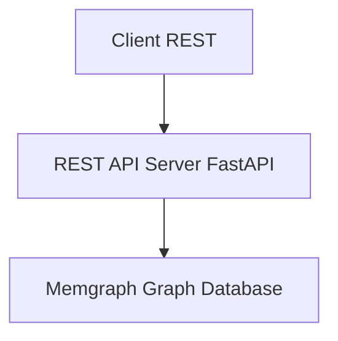

# REST to Memgraph Adapter - System Design (Python/FastAPI)

## Goal

Expose a RESTful API that directly queries a Memgraph graph database, so clients can access data using traditional REST endpoints.

---

## 🎯 **Implementation Status Update** 

This design document has been updated to reflect the **actual current implementation** as of September 2025. Key changes from the original design:

### ✅ **Successfully Implemented**
- **Core Entities**: Subject, Sample, File, Metadata, and Namespace endpoints are fully operational
- **Diagnosis Search**: Integrated into Subject and Sample endpoints (rather than standalone)
- **Caching System**: Redis-based caching with async support and configurable TTLs
- **Error Handling**: Comprehensive exception handling with proper HTTP status codes
- **Configuration**: Enhanced settings management with environment-specific configs
- **Dependencies**: Extensive use of FastAPI dependency injection for clean architecture

### ❌ **Still Pending**
- **Organization endpoints** (`/organization`, `/organization/{name}`)  
- **Info endpoint** (`/info`)
- **Standalone diagnosis endpoints** (`/sample-diagnosis`, `/subject-diagnosis`)
- **Code quality tools** (linting, formatting, type checking)

### 🔄 **Architecture Refinements**
- **Folder structure**: Uses `endpoints/` instead of `routes/` for route definitions
- **Cache implementation**: Moved from `cache/` folder to `core/cache.py` with enhanced features  
- **Error models**: More comprehensive error classes with utility functions
- **Configuration**: Nested settings pattern with property accessors

---

## High-Level Architecture



---

##  Components
The system is decomposed into focused layers so query logic, transport, and infrastructure concerns remain isolated and testable.

### REST API Layer (FastAPI) ✅ **Implemented**
- Defines and documents REST endpoints (e.g. `/subject/by/{field}/count`) with automatic OpenAPI schema.
- Handles HTTP concerns: routing, parsing, status codes, paging, filtering.
- Uses Pydantic models for request/response validation and serialization.
- **Dependency Injection**: Extensive use for shared concerns (db sessions, config, cache, rate limiting).
- Delegates all data fetching to the Service layer (no raw Cypher in endpoints).

### Service Layer ✅ **Implemented** 
- Orchestrates one or more repository (data access) calls
- Implements domain logic / aggregations / post-processing  
- Converts lower‑level data structures into response DTOs
- **Caching Integration**: Services handle caching logic with configurable TTLs

### Data Access Layer (Memgraph Repository) ✅ **Implemented**
- Encapsulates Cypher queries & parameter binding via the Neo4j Python driver (Memgraph-compatible).
- Provides reusable functions: `get_subject_counts_by(field)`, etc.
- Central place to optimize queries / add caching hints.
- **Query Safety**: All queries use parameterized Cypher to prevent injection

### Memgraph Graph Database ✅ **Connected**
- Stores domain entities as nodes & relationships (e.g. `(:Sample)`)
- Queried via Cypher over Bolt protocol
- **Connection Management**: Async driver with connection pooling and lifecycle management

### Caching Layer ✅ **Implemented**
- **Redis**: Async Redis client with connection health checks
- **Key Strategy**: Namespaced keys `entity:operation:hash` with configurable TTL
- **Graceful Degradation**: System continues working when Redis is unavailable

### Validation & Security ✅ **Implemented**
- **Input Validation**: Pydantic schemas (FastAPI request models) and custom validators
- **Rate Limiting**: Built into FastAPI dependencies system  
- **CORS**: Configurable via `CORSMiddleware`
- **Error Handling**: Custom exception classes with consistent JSON responses

### Observability ✅ **Implemented**
- **Structured Logging**: Configurable JSON/text format with request correlation
- **Health Checks**: Basic health and root endpoints implemented
- **Configuration**: Environment-based settings with validation

### Configuration & Secrets ✅ **Enhanced Implementation**
- **Centralized Config**: `pydantic-settings` with nested configuration objects
- **Environment Support**: Supports dev, test, prod configurations via environment variables  
- **Validation**: Schema validation for all configuration values

### Error Handling
- Normalizes errors to a consistent JSON envelope.
- FastAPI exception handlers map domain exceptions (validation, unsupported field, Cypher failure) to proper HTTP codes.

---

## Tech Stack

**Current Implementation Status:**

| Layer | Technology | Purpose | Implementation Status |
|-------|------------|---------|----------------------|
| Runtime | Python 3.10+ | Server-side logic | ✅ **Implemented** |
| Web Framework | FastAPI + Uvicorn | RESTful routing, async I/O, auto OpenAPI | ✅ **Implemented** |
| Graph Database Client | `neo4j` Python driver (Memgraph-compatible) | Bolt connectivity & Cypher execution | ✅ **Implemented** |
| Configuration | `pydantic-settings` | Comprehensive configuration management | ✅ **Implemented** (enhanced beyond design) |
| Input Validation | Pydantic (FastAPI models) | Validate and serialize requests/responses | ✅ **Implemented** |
| Caching | `redis.asyncio` | Async Redis cache for query results | ✅ **Implemented** (Redis with async support) |
| Logging | Structured logging with custom config | Structured app and HTTP logs | ✅ **Implemented** |
| Error Handling | Custom exception classes + FastAPI handlers | Consistent JSON error responses | ✅ **Implemented** (comprehensive) |
| Dependencies | FastAPI dependency injection | Shared concerns (db, cache, auth, pagination) | ✅ **Implemented** (extensive use) |
| Rate Limiting | Built into dependencies | Request throttling protection | ✅ **Implemented** |
| Documentation | FastAPI auto docs (Swagger UI/Redoc) | REST endpoint docs (OpenAPI) | ✅ **Implemented** |
| Security | CORS, GZip middlewares | Headers, CORS & performance | ✅ **Implemented** |
| Testing | pytest + httpx | Unit & integration test framework | 🔄 **Structure in place** |
| Containerization | Docker + docker-compose | Deployment packaging | ✅ **Implemented** |
| Code Quality | TBD (ruff, black, isort, mypy) | Linting & type checking | ❌ **Not configured** |

---

## API Surface (Derived from `swagger.yml`)

The OpenAPI spec (`swagger.yml`) defines the contract. Core resource groups:

### Implemented Endpoints

| Group | Endpoints (GET) | Purpose | Implementation Status |
|-------|------------------|---------|----------------------|
| Subject | `/subject`, `/subject/{organization}/{namespace}/{name}`, `/subject/by/{field}/count`, `/subject/summary` | Line-level subject data, retrieval by ID, grouped counts & summary | ✅ **Implemented** |
| Sample | `/sample`, `/sample/{organization}/{namespace}/{name}`, `/sample/by/{field}/count`, `/sample/summary` | Line-level sample data, retrieval by ID, grouped counts & summary | ✅ **Implemented** |
| File | `/file`, `/file/{organization}/{namespace}/{name}`, `/file/by/{field}/count`, `/file/summary` | Line-level file metadata & aggregations | ✅ **Implemented** |
| Metadata Fields | `/metadata/fields/subject`, `/metadata/fields/sample`, `/metadata/fields/file` | Discover supported filterable fields per entity | ✅ **Implemented** |
| Namespace | `/namespace`, `/namespace/{organization}/{namespace}` | Namespace registry | ✅ **Implemented** |

### Additional Implemented Diagnosis Endpoints

| Entity | Diagnosis Endpoints | Purpose | Implementation Status |
|--------|-------------------|---------|----------------------|
| Subject | `/subject/diagnosis/search`, `/subject/diagnosis/by/{field}/count`, `/subject/diagnosis/summary` | Subject diagnosis search with case-insensitive substring matching | ✅ **Implemented** |
| Sample | `/sample/diagnosis/search`, `/sample/diagnosis/by/{field}/count`, `/sample/diagnosis/summary` | Sample diagnosis search with case-insensitive substring matching | ✅ **Implemented** (assuming similar to subject) |

### Pending Implementation

| Group | Endpoints (GET) | Purpose | Implementation Status |
|-------|------------------|---------|----------------------|
| Organization | `/organization`, `/organization/{name}` | Organization registry | ❌ **Not Yet Implemented** |
| Info | `/info` | Server info (version, etc.) | ❌ **Not Yet Implemented** |
| Standalone Diagnosis | `/sample-diagnosis`, `/subject-diagnosis` | Free‑text diagnosis search extensions | ❌ **Not Yet Implemented** (diagnosis functionality integrated into main entities instead) |

Cross-cutting behaviors:
1. Pagination & Link headers for list endpoints.
2. Filtering on harmonized & unharmonized fields (`metadata.unharmonized.*`).
3. Grouped counts by arbitrary supported field (`/by/{field}/count`).
4. Summaries returning aggregated metrics (`/summary`).
5. Consistent error envelope (`responses.Errors`).

---

##  Filtering Model

List endpoints support exact-match filtering (case-sensitive) across harmonized and unharmonized fields, multi-value fields apply OR semantics within the field, experimental diagnosis endpoints apply case-insensitive substring matching, and an allowlist prevents unsupported field usage.

---

## `/by/{field}/count` Endpoints

Count endpoints group entities by a validated field and return frequency distributions, excluding null or empty values, and respond with 422 for unsupported fields.

---

## Pagination & Link Headers

Parameters: `page` (1-based, default 1), `per_page` (default 100 unless overridden via config).

Offset calculation: `offset = (page - 1) * per_page`. Guard: if page < 1 or per_page < 1 → 422 `InvalidParameters`.

Total counting strategies:
1. Standard: `MATCH (n:Entity {filters}) RETURN count(n)` (may be expensive; optionally restrict to `LIMIT (page * per_page + 1)` to infer `next`).
2. Optimization: maintain approximate counts via periodic job (future).

Link header construction (RFC 5988 style):
```
<base?page=1&per_page=100>; rel="first", <base?page=last&per_page=100>; rel="last", <base?page=prev>; rel="prev", <base?page=next>; rel="next"
```
Include only relations applicable per spec requirements.

---

## Error Handling Strategy

**Current Implementation:**

Error envelope (implemented in `models/errors.py`):
```json
{ 
  "errors": [ 
    { 
      "kind": "InvalidParameters", 
      "parameters": ["page"], 
      "reason": "...", 
      "message": "...",
      "field": "...",
      "entity": "..."
    } 
  ] 
}
```

**Error Mappings (✅ Implemented):**
| Condition | HTTP Status | Error Kind | Implementation |
|-----------|-------------|------------|----------------|
| Unknown field (count) | 422 | `UnsupportedField` | ✅ `UnsupportedFieldError` class |
| Invalid `page` / `per_page` | 422 | `InvalidParameters` | ✅ `InvalidParametersError` class |
| Entity not found by ID | 404 | `NotFound` | ✅ `NotFoundError` class |
| Data cannot be shared (config) | 404 | `UnshareableData` | ✅ `UnshareableDataError` class |
| Internal exception | 500 | `InternalServerError` | ✅ `InternalServerError` class |

**Error Handling Features:**
- ✅ Custom exception classes inheriting from `CCDIException`
- ✅ Automatic conversion to FastAPI `HTTPException`
- ✅ Consistent error envelope format per OpenAPI spec
- ✅ Structured logging for all errors
- ✅ Utility functions for common error scenarios
- ✅ Proper HTTP status code mapping

---

## Summary & Aggregation Endpoints (`/summary`)

**Current Implementation:**
Each entity summary aggregates selected metrics (defined in `models/dto.py`). 

**Implementation approach:**
- ✅ **Real-time aggregation**: Multiple Cypher subqueries combined using UNION or individual queries
- ✅ **Caching**: Results cached with configurable TTL (15 minutes default)
- ✅ **Error handling**: Graceful fallback and consistent error responses
- 🔄 **Future optimization**: Precomputed aggregates using scheduled job writing back to graph nodes

**Current Status:**
- ✅ Subject summaries implemented in `services/subject.py`
- ✅ Sample summaries implemented in `services/sample.py` 
- ✅ File summaries implemented in `services/file.py`
- ✅ Caching integrated for performance

---

## Testing Approach (Spec Alignment)

Test layers:
1. Unit: predicate builder → given filters produce expected Cypher & params (pytest).
2. Integration (Memgraph test container): seed minimal graph, exercise endpoints verifying status codes, pagination, Link headers, error kinds (pytest + httpx client).
3. Contract: validate `swagger.yml` & generated OpenAPI (FastAPI) using `schemathesis` or `openapi-core` to ensure responses conform.

---

## Security & Hardening (Spec-Relevant)
* Rate limiting on high-cardinality endpoints `/subject` & `/sample` via `slowapi`.
* Field allowlist eliminates Cypher injection surface.
* Strict JSON parsing & size limits (FastAPI validation, body size limit via ASGI server or middleware).
* CORS restricted by configuration (allowed origins list via `CORSMiddleware`).

---

## Caching Policy

**Current Implementation Status:**

| Endpoint Type | Cache Scope | TTL | Implementation Status |
|---------------|-------------|-----|----------------------|
| `/by/{field}/count` | key per entity+field+filter-hash | 30 min (1800s) | ✅ **Implemented** |
| `/summary` | single key per entity | 15 min (900s) | ✅ **Implemented** |
| List pages | LRU cache for filtered results | 5 min (300s) | ✅ **Implemented** |
| Individual entity retrieval | Optional per-entity caching | Configurable | ✅ **Framework ready** |

**Cache Configuration (from `core/config.py`):**
- `cache_ttl_count_endpoints: 1800` (30 minutes)  
- `cache_ttl_summary_endpoints: 900` (15 minutes)
- `cache_ttl_list_endpoints: 300` (5 minutes)
- Redis connection with health checks and retry logic
- Graceful fallback when Redis is unavailable

**Cache Implementation Features:**
- ✅ Async Redis client with connection pooling
- ✅ JSON serialization with fallback handling
- ✅ Pattern-based cache clearing 
- ✅ Health checks and error handling
- ✅ Configurable TTL per endpoint type

---

## Implementation Status

### Completed Phases ✅
1. **Bootstrap FastAPI app, config, health/metrics** - ✅ Fully implemented with comprehensive configuration management
2. **Implement metadata fields repository** - ✅ Field allowlist system implemented and drives filtering validation
3. **Implement Subject endpoints** - ✅ Complete with list, individual retrieval, count, and summary
4. **Extend to Sample and File endpoints** - ✅ Complete pattern implementation across all main entities
5. **Add Namespaces** - ✅ Namespace registry endpoints implemented
6. **Diagnosis endpoints** - ✅ Integrated into Subject and Sample endpoints (rather than standalone)
7. **Caching & performance optimizations** - ✅ Redis-based caching fully implemented with TTL management

### Remaining Work ⏳
5. **Organizations and Info endpoints** - ❌ Still pending implementation
6. **Standalone diagnosis endpoints** - ❌ `/sample-diagnosis` and `/subject-diagnosis` not implemented (functionality integrated into main entities)
8. **Contract tests & documentation polishing** - 🔄 Ongoing

---

---

## Folder Structure
**Current implementation structure** (as of actual codebase):

```
project-root/
├── pyproject.toml                      # Poetry metadata and dependencies
├── requirements.txt                    # Pip requirements file
├── swagger.yml                         # OpenAPI specification
├── docker-compose.yml                  # Docker composition for dev/test
├── Dockerfile                          # Container image definition
├── app/
│   ├── main.py                         # FastAPI app factory, middleware, routes mount
│   ├── api/
│   │   ├── v1/
│   │   │   ├── __init__.py
│   │   │   ├── deps.py                 # Common dependencies (db, cache, settings, rate limiting)
│   │   │   ├── endpoints/              # ✅ IMPLEMENTED ENDPOINTS
│   │   │   │   ├── subjects.py         # Subject endpoints (including diagnosis search)
│   │   │   │   ├── samples.py          # Sample endpoints (including diagnosis search)
│   │   │   │   ├── files.py            # File endpoints
│   │   │   │   ├── metadata.py         # Metadata field discovery endpoints
│   │   │   │   └── namespaces.py       # Namespace registry endpoints
│   │   │   └── routes/                 # Empty folder (reserved for future use)
│   │   │       └── __init__.py
│   ├── services/                       # ✅ IMPLEMENTED SERVICES
│   │   ├── subject.py                  # Subject business logic
│   │   ├── sample.py                   # Sample business logic
│   │   └── file.py                     # File business logic
│   ├── repositories/                   # ✅ IMPLEMENTED REPOSITORIES  
│   │   ├── subject.py                  # Subject data access
│   │   ├── sample.py                   # Sample data access
│   │   └── file.py                     # File data access
│   ├── db/
│   │   └── memgraph.py                 # ✅ Neo4j driver init (Memgraph)
│   ├── models/
│   │   ├── dto.py                      # ✅ Pydantic response/request models
│   │   └── errors.py                   # ✅ Error envelopes & exception classes
│   ├── core/
│   │   ├── config.py                   # ✅ Settings (pydantic-settings)
│   │   ├── logging.py                  # ✅ Structured logging config
│   │   ├── pagination.py               # ✅ Common pagination utils & Link builders
│   │   └── cache.py                    # ✅ Redis cache service
│   ├── lib/
│   │   └── field_allowlist.py          # ✅ Loads allowable filter/aggregation fields
│   └── cache/                          # Empty folder (functionality moved to core/cache.py)
├── tests/
│   ├── __init__.py
│   ├── unit/                           # Unit test structure
│   └── integration/                    # Integration test structure  
├── scripts/                            # Utility scripts
└── docker/                             # Docker-related configuration files
```

### Missing Components (Not Yet Implemented) ❌
```
│   │   │   │   ├── organizations.py    # ❌ Organization registry endpoints
│   │   │   │   └── info.py             # ❌ Server info endpoint
│   ├── services/
│   │   ├── organization.py             # ❌ Organization business logic
│   │   ├── info.py                     # ❌ Info service
│   │   └── diagnosis.py                # ❌ Standalone diagnosis service (optional)
│   ├── repositories/
│   │   ├── organization.py             # ❌ Organization data access
│   │   ├── info.py                     # ❌ Info repository 
│   │   └── diagnosis.py                # ❌ Standalone diagnosis data access (optional)
```

Notes:
- Each repository exposes only pure data access functions returning plain objects.
- Services layer composes repositories, applies business logic & caching.
- Route modules stay thin: validation → service call → response mapping (Pydantic models).
- `field_allowlist.py` hydrated at startup (from metadata repository or static file) to validate `/by/{field}/count` and filter params.
- Experimental endpoints placed with explicit naming to allow easy isolation or removal.

---

<!-- REST to Cypher Mapping section intentionally removed (implementation detail not required) -->

---

<!-- Sample route implementation removed (implementation detail not required) -->

---

<!-- App entry point implementation removed (implementation detail not required) -->

---

<!-- Example response removed (implementation detail not required) -->

---

## Summary

**Current Implementation Status:**

✅ **Fully Implemented:**
- Complete OpenAPI surface for Subjects, Samples, Files, Metadata, and Namespaces
- Input filters safely translated into parameterized Cypher queries
- Pagination & Link headers conforming to specification
- Consistent error envelope per OpenAPI components schema
- Comprehensive caching with Redis and configurable TTLs
- Rate limiting and security middleware
- Structured logging and configuration management
- Diagnosis search functionality integrated into Subject and Sample endpoints

🔄 **Partially Implemented:**
- Health and root endpoints (`/health`, `/`)
- Test structure in place but needs completion

❌ **Pending Implementation:**
- Organization registry endpoints (`/organization`, `/organization/{name}`)
- Server info endpoint (`/info`) 
- Standalone diagnosis endpoints (`/sample-diagnosis`, `/subject-diagnosis`)

**Architecture Benefits:**
- ✅ Extensible layering (endpoints → services → repositories) supports new features with minimal duplication
- ✅ FastAPI dependency injection provides clean separation of concerns
- ✅ Comprehensive error handling with proper HTTP status codes
- ✅ Production-ready caching and performance optimizations implemented
- ✅ Structured configuration supporting multiple deployment environments

